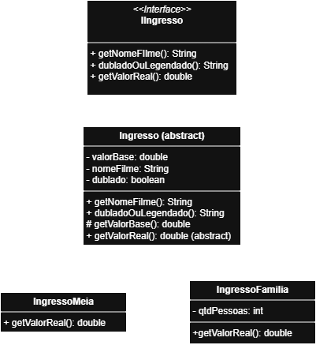

# 🎬 Sistema de Ingressos de Cinema

Este projeto implementa uma hierarquia de classes para gerenciar diferentes tipos de ingressos de cinema, aplicando **Herança**, **Polimorfismo** e princípios do **SOLID**.

## 📌 Funcionalidades

- Cadastro de ingressos com:
    - Nome do filme
    - Valor base
    - Tipo de exibição: **Dublado** ou **Legendado**
- Tipos de ingresso:
    - **Ingresso Normal**
    - **Meia Entrada** (50% do valor base)
    - **Ingresso Família** (multiplicado pelo número de pessoas, com 5% de desconto se > 3 pessoas)

## 🏗️ Estrutura do Projeto

- `IIngresso` → Interface que define o contrato.
- `Ingresso` → Classe abstrata com propriedades comuns.
- `IngressoMeia` → Implementa a regra de meia entrada.
- `IngressoFamilia` → Implementa a regra para grupos familiares.

## 📖 Diagrama de Classes




- Java 17+
- UML (para modelagem)

## ▶️ Exemplo de Uso

```java
public class Main {
    public static void main(String[] args) {
        IIngresso ingressoNormal = new IngressoNormal(20.0, "Interestelar", true);
        IIngresso ingressoMeia = new IngressoMeia(20.0, "Matrix", false);
        IIngresso ingressoFamilia = new IngressoFamilia(15.0, "Toy Story", true, 4);

        System.out.println("Normal: R$ " + ingressoNormal.getValorReal());
        System.out.println("Meia: R$ " + ingressoMeia.getValorReal());
        System.out.println("Família: R$ " + ingressoFamilia.getValorReal());
    }
}
```

---

